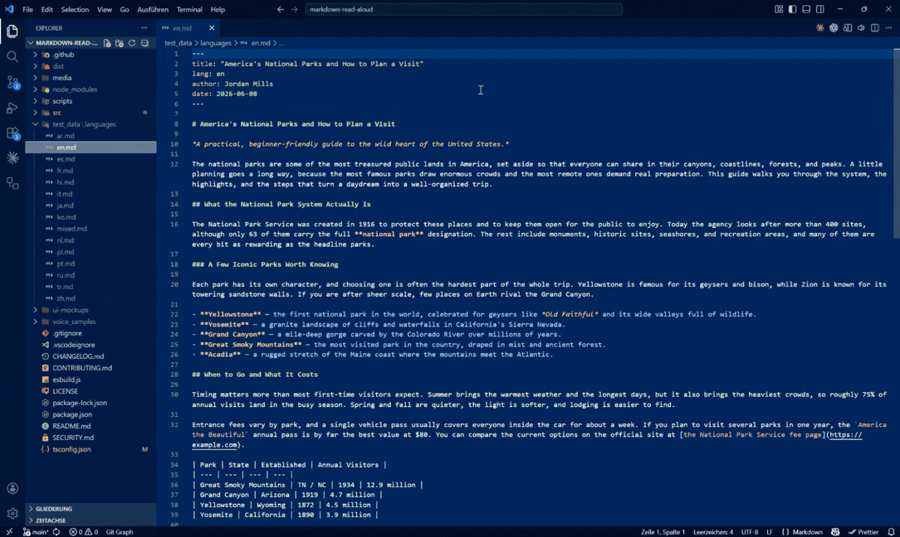

[](https://marketplace.visualstudio.com/items?itemName=RobinReiche.markdown-read-aloud)
[](https://marketplace.visualstudio.com/items?itemName=RobinReiche.markdown-read-aloud)
[](https://marketplace.visualstudio.com/items?itemName=RobinReiche.markdown-read-aloud&ssr=false#review-details)
[](https://github.com/Robin-Reiche/markdown-read-aloud/actions/workflows/ci.yml)
[](LICENSE)

# Markdown Read Aloud

> **Free neural text-to-speech (TTS) for Markdown — no API key, no sign-up.**

Listen to your Markdown instead of reading it. **Markdown Read Aloud** turns any
`.md` file into a beautiful reader view and reads it as clean, natural speech using
high-quality **neural voices — for free**. Built for the age of AI-generated docs,
when you have more Markdown to get through than time to read it: skim long READMEs,
specs and ADRs by ear, or **proofread your own writing by listening** to it.



## Free neural voices, no API key

A free, no-sign-up alternative to **ElevenLabs, Speechify and Azure TTS** for reading
Markdown aloud. Every other way to get *natural* voices in VS Code makes you pay or sign
up; the free options sound robotic. Markdown Read Aloud gives you neural quality for free,
with zero setup.

| | Voice quality | Cost | Setup |
|---|---|---|---|
| **Markdown Read Aloud** | 🟢 Neural | 🟢 **Free** | 🟢 None |
| ElevenLabs / Speechify / Azure | 🟢 Neural | 🔴 Paid API key | 🟡 Account + key |
| System / OS-voice extensions | 🔴 Robotic | 🟢 Free | 🟢 None |

It uses Microsoft Edge's neural voices — the same models behind Azure's "natural" voices —
through the same endpoint Edge's own Read Aloud uses. No account, no key, nothing to configure.

## Natural text-to-speech, built for Markdown

- **🎧 Cloud-quality voices, free.** Genuinely expressive neural text-to-speech, not the robotic system voice.
- **📖 A real reader, not a raw preview.** Your document renders as clean, styled prose —
  no `#`/`*`/`[]()` noise — with the spoken sentence highlighted in place and gentle
  auto-scroll that follows the voice.
- **🌍 Automatic language detection.** Reads German with a German voice, English with
  an English voice, and so on across **75 languages** — detected from the file itself.
  One consistent voice per document by default; optional per-paragraph switching for
  mixed-language files.
- **♀ ♂ Curated voices, not a wall of options.** One great female and one great male
  voice per language by default. Power users can still pick any voice.
- **⏩ Speed & start point you control.** 0.5×–2.5× live, start from the cursor, a
  selection, any heading — or click any sentence to read from exactly there.
- **🔖 Picks up where you left off.** Every document remembers your last position.
- **🧹 Handles messy Markdown.** Headings, lists, links, tables, code fences and
  special characters become prose for the voice, never syntax.
- **🎚️ Keeps playing in the background** — with a play/pause mini-player in the
  VS Code status bar, the reader tab doesn't even need to be visible.

## Automatic language detection across 75 languages

The document's language is detected from its text and matched to a native voice
automatically — including German, Spanish, French, Italian, Portuguese, Dutch, Polish,
Russian, Japanese, Chinese, Korean and more. No setting to flip. By default one
consistent voice reads the whole document (easiest to follow); for mixed-language files
you can switch the voice **per paragraph** to match each paragraph's language.

## Read aloud from cursor, selection, or any heading

1. Open a Markdown file.
2. Run a command (Command Palette, or the **🔊 speaker icon** in the editor title bar):
   - **Read Aloud: Read Whole Document**
   - **Read Aloud: Read from Cursor** — `Ctrl+Alt+R` (`Cmd+Alt+R` on macOS)
   - **Read Aloud: Read Selection** (right-click a selection)
3. The reader opens beside your editor and starts speaking. Click any sentence to read
   from there, hover a heading for **▶ Read section**, drag the progress bar (headings
   appear as chapter ticks) to jump anywhere.
   - Play/Pause from anywhere: `Ctrl+Alt+Space`, or click the status-bar mini-player.
   - In the reader: `Space` play/pause, `←`/`→` sentences, `+`/`−` speed, `M` mute,
     `F` reading font, `Esc` stop.

## A reading room inside VS Code

The reader is built for long sessions, not five-second glances:

- **Follows your VS Code theme** by default, with three hand-tuned reading themes —
  Study (dark), Daylight (light) and Paper (sepia).
- **Four bundled reading fonts** — Literata, Inter, Atkinson Hyperlegible (built for
  maximum legibility) and IBM Plex Mono — plus Compact / Cozy / Wide / Full comfort
  presets. Full drops the centered column limit and lets the text run the whole
  width of the panel.
- **Opens where you want it.** By default the reader splits the editor and sits next
  to your document. Set `markdownReadAloud.openLocation` to `active` and it opens as
  a tab in the current editor group instead, without splitting anything.
- **Reading follows you, not the other way around.** Scroll wherever you like while
  listening; a quiet “Back to reading” pill glides you back to the spoken sentence.
- **Ambient focus** dims everything but the sentence being read.
- **Collapsible sections** with per-section reading times, and a **sleep timer**
  (stop after the current section, or 15/30/60 minutes with a gentle fade).

## Proofread with your ears, fix with one click

Hearing your own text catches the mistakes your eyes skip. When you hear one:

- **Alt+Click the sentence** → the editor opens at exactly that source line.
- Or hit the **✏️ edit button** → the source opens beside the reader at your current
  sentence, and the reader re-renders live as you type — without losing your place or
  interrupting playback.
- Teach the voices your jargon with the **pronunciation dictionary**
  (`markdownReadAloud.pronunciations`, e.g. `{ "nginx": "engine x" }`) — put it in
  workspace settings and your whole team shares it.

## Accessibility & proofreading

Hearing text instead of reading it helps with **dyslexia, low vision and reading
fatigue**, and catches mistakes the eye skips — so it doubles as a **proofreader** for
your own docs. It's a lightweight read-aloud / screen-reader companion for the one format
developers write most: Markdown.

## Engines — offline & system-voice fallback

| Engine | Quality | Network | Notes |
|---|---|---|---|
| **Edge** (default) | ★★★ neural | online | Free, no key. Sends the text being read to Microsoft. |
| **Supertonic** | ★★★ neural | offline | Local neural voices via a Supertonic server on your machine (see below). |
| **Browser** | ★ system | offline | Your OS voices. Automatic fallback if Edge is unreachable. |

Switch via the `markdownReadAloud.engine` setting. The engine choice is an
application-level (user) setting: a workspace's `.vscode/settings.json` cannot
override it, so opening someone else's repository can never silently change
whether your text goes online.

### Using Supertonic (offline neural voices)

The Supertonic engine talks to [Supertonic](https://github.com/supertone-inc/supertonic)'s
official local server over loopback HTTP. One-time setup:

```bash
pip install 'supertonic[serve]'
supertonic serve --host 127.0.0.1 --port 7788
```

The server's **first start downloads ~386 MB of model files** from Hugging Face;
after that, synthesis is fully local (44.1 kHz WAV, no GPU required). Then set
`markdownReadAloud.engine` to `supertonic`. The command
**Read Aloud: Check Local Supertonic Server** verifies the server is reachable
without sending any document text.

Privacy behavior is strict and fail-closed:

- The extension only ever connects to `http://127.0.0.1:7788` (fixed loopback;
  not configurable by workspaces).
- If the server is not running, reading **stops** with setup instructions.
  Your text is never silently sent to an online engine instead; switching to
  Edge is a separate, explicit button that warns text will leave the machine.

Note for Remote SSH / WSL / Dev Containers: the extension host runs on the
remote side there, so `127.0.0.1:7788` refers to the remote machine or
container — start `supertonic serve` in that environment. The first release
targets standard local desktop VS Code.

#### Managing the Supertonic server

Useful commands and facts for day-to-day operation:

```bash
# is it up? (same probe the extension uses; sends no text)
curl http://127.0.0.1:7788/v1/health

# list the built-in voice styles (F1–F5 female, M1–M5 male)
supertonic list-voices

# model location and info
supertonic info      # model files live in ~/.cache/supertonic3
```

- **Interactive API docs** are served at `http://127.0.0.1:7788/docs`.
- **Model files** are cached in `~/.cache/supertonic3` (~386 MB). Deleting the
  cache makes the next server start re-download them; copying that directory to
  another machine avoids the download entirely (useful for air-gapped setups).
- **Pinning:** install with a pinned version (`pip install supertonic==1.3.1`)
  or from a lock file so upgrades are deliberate. This repo's tested server
  versions are recorded in `supertonic-server-requirements.lock.txt`.
- **Stopping** the server (Ctrl+C, or stopping its service) is always safe —
  the extension fails closed and tells you how to restart it.
- **Run it as a service** so it survives reboots. On Linux/WSL2 with systemd,
  a user unit works well:

  ```ini
  # ~/.config/systemd/user/supertonic.service
  [Unit]
  Description=Supertonic local TTS server (loopback-only)

  [Service]
  ExecStart=/path/to/venv/bin/supertonic serve --host 127.0.0.1 --port 7788
  Restart=on-failure
  RestartSec=5

  [Install]
  WantedBy=default.target
  ```

  Then `systemctl --user enable --now supertonic` (and `loginctl enable-linger
  $USER` to start it at boot rather than first login). Logs:
  `journalctl --user -u supertonic`.
- **Upstream status:** Supertone has announced the open-source repository will
  be archived. The PyPI package and open model weights are expected to remain
  available, but keep a fork/archive of anything you depend on.

## Settings

| Setting | Default | Description |
|---|---|---|
| `markdownReadAloud.engine` | `edge` | TTS engine to use. |
| `markdownReadAloud.preferredGender` | `female` | Default voice gender. |
| `markdownReadAloud.speed` | `1.0` | Default playback speed (0.5–2.5). |
| `markdownReadAloud.autoDetectLanguage` | `true` | Detect the document's main language and pick a matching voice. |
| `markdownReadAloud.perParagraphLanguage` | `false` | Switch voice per paragraph to match each paragraph's language (mixed-language docs). Off = one consistent voice (easier to follow). |
| `markdownReadAloud.fallbackLanguage` | `en-US` | Used when detection is unreliable. |
| `markdownReadAloud.voiceOverrides` | `{}` | Per-language voice override, e.g. `{ "de-DE": "de-DE-KatjaNeural" }`. |
| `markdownReadAloud.announceHeadings` | `false` | Say "Heading" before headings. |
| `markdownReadAloud.codeBlocks` | `announce` | `skip` / `announce` / `read` code blocks. |
| `markdownReadAloud.tables` | `skip` | `skip` / `read` tables. |
| `markdownReadAloud.highlightWhileReading` | `true` | Highlight the current sentence in the reader. |
| `markdownReadAloud.openLocation` | `beside` | Where the reader opens. `beside` splits the editor into a second column, `active` opens it as a tab in the current editor group. Applies the next time the reader opens. |
| `markdownReadAloud.volume` | `1.0` | Default playback volume (0–1). |
| `markdownReadAloud.pronunciations` | `{}` | Pronunciation overrides, e.g. `{ "nginx": "engine x", "kubectl": "kube control" }`. |

## Privacy & note on the Edge engine

The Edge engine sends the text to be spoken to Microsoft's public Edge "Read Aloud"
endpoint to synthesize audio. No account or key is required and nothing else is
collected by this extension. This endpoint is the same one Microsoft Edge uses; it is
unofficial for third-party use and could change. If it becomes unavailable, the
extension automatically falls back to your system voices. For a fully offline,
no-network experience, use the Supertonic engine (local server, see above) or
the Browser engine (system voices). When Supertonic is selected, document text
is only ever sent to the local loopback server — never to an online service —
and any failure stops reading instead of falling back online.

## ❤️ Support This Project

If Markdown Read Aloud saves you time, you can support its continued development — completely optional, always appreciated:

[](https://github.com/sponsors/Robin-Reiche)
[](https://ko-fi.com/robinreiche)

## License

MIT © Robin Reiche. See [LICENSE](LICENSE).
