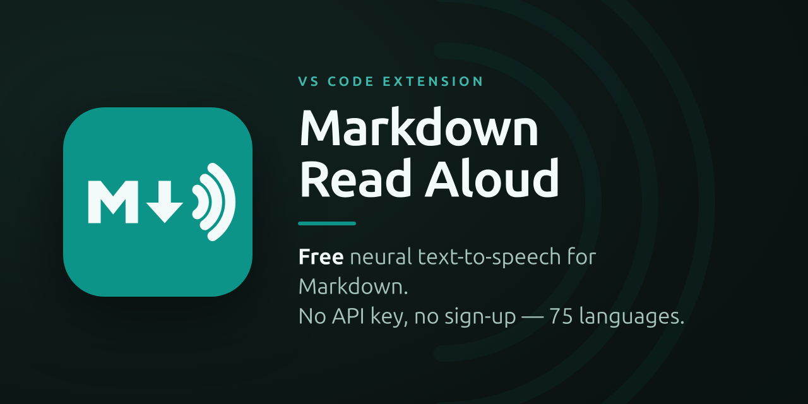

# Markdown Read Aloud

> **Free neural text-to-speech (TTS) for Markdown — no API key, no sign-up.**

Listen to your Markdown instead of reading it. **Markdown Read Aloud** turns any
`.md` file into clean, natural speech using high-quality **neural voices — for free**.
Built for the age of AI-generated docs, when you have more Markdown to get through
than time to read it: skim long READMEs, specs and ADRs by ear, or **proofread your
own writing by listening** to it.

<!-- TODO: add media/demo.gif (a short screen capture of the player reading + sentence highlight), then re-enable the line below.

-->

## Free neural voices, no API key

A free, no-sign-up alternative to **ElevenLabs, Speechify and Azure TTS** for reading
Markdown aloud. Every other way to get *natural* voices in VS Code makes you pay or sign
up; the free options sound robotic. Markdown Read Aloud gives you neural quality for free,
with zero setup.

| | Voice quality | Cost | Setup |
|---|---|---|---|
| **Markdown Read Aloud** | 🟢 Neural | 🟢 **Free** | 🟢 None |
| ElevenLabs / Speechify / Azure | 🟢 Neural | 🔴 Paid API key | 🟡 Account + key |
| System / OS-voice extensions | 🔴 Robotic | 🟢 Free | 🟢 None |

It uses Microsoft Edge's neural voices — the same models behind Azure's "natural" voices —
through the same endpoint Edge's own Read Aloud uses. No account, no key, nothing to configure.

## Natural text-to-speech, built for Markdown

- **🎧 Cloud-quality voices, free.** Genuinely expressive neural text-to-speech, not the robotic system voice.
- **🌍 Automatic language detection.** Reads German with a German voice, English with
  an English voice, and so on across **75 languages** — detected from the file itself.
  One consistent voice per document by default; optional per-paragraph switching for
  mixed-language files.
- **♀ ♂ Curated voices, not a wall of options.** One great female and one great male
  voice per language by default. Power users can still pick any voice.
- **⏩ Speed & start point you control.** 0.5×–2.5× live, start from the cursor, a
  selection, or jump to any heading.
- **🧹 Handles messy Markdown.** Strips headings, lists, links, tables, code fences and
  special characters so the voice reads prose, not syntax.
- **🖍️ Follow along.** The sentence being read is highlighted and scrolled to in the editor.
- **🎚️ Keeps playing in the background** while you work in other files.

## Automatic language detection across 75 languages

The document's language is detected from its text and matched to a native voice
automatically — including German, Spanish, French, Italian, Portuguese, Dutch, Polish,
Russian, Japanese, Chinese, Korean and more. No setting to flip. By default one
consistent voice reads the whole document (easiest to follow); for mixed-language files
you can switch the voice **per paragraph** to match each paragraph's language.

## Read aloud from cursor, selection, or any heading

1. Open a Markdown file.
2. Run a command (Command Palette, or the **🔊 speaker icon** in the editor title bar):
   - **Read Aloud: Read Whole Document**
   - **Read Aloud: Read from Cursor** — `Ctrl+Alt+R` (`Cmd+Alt+R` on macOS)
   - **Read Aloud: Read Selection** (right-click a selection)
3. A player opens beside your editor. Hit ▶, pick ♀/♂, set the speed, jump around the outline.
   - Play/Pause from anywhere: `Ctrl+Alt+Space`.

## Accessibility & proofreading

Hearing text instead of reading it helps with **dyslexia, low vision and reading
fatigue**, and catches mistakes the eye skips — so it doubles as a **proofreader** for
your own docs. It's a lightweight read-aloud / screen-reader companion for the one format
developers write most: Markdown.

## Engines — offline & system-voice fallback

| Engine | Quality | Network | Notes |
|---|---|---|---|
| **Edge** (default) | ★★★ neural | online | Free, no key. Recommended. |
| **Supertonic** | ★★★ neural | offline | Fully on-device (downloads models on first use). *Coming in a later update.* |
| **Browser** | ★ system | offline | Your OS voices. Automatic fallback if Edge is unreachable. |

Switch via the `markdownReadAloud.engine` setting.

## Settings

| Setting | Default | Description |
|---|---|---|
| `markdownReadAloud.engine` | `edge` | TTS engine to use. |
| `markdownReadAloud.preferredGender` | `female` | Default voice gender. |
| `markdownReadAloud.speed` | `1.0` | Default playback speed (0.5–2.5). |
| `markdownReadAloud.autoDetectLanguage` | `true` | Detect the document's main language and pick a matching voice. |
| `markdownReadAloud.perParagraphLanguage` | `false` | Switch voice per paragraph to match each paragraph's language (mixed-language docs). Off = one consistent voice (easier to follow). |
| `markdownReadAloud.fallbackLanguage` | `en-US` | Used when detection is unreliable. |
| `markdownReadAloud.voiceOverrides` | `{}` | Per-language voice override, e.g. `{ "de-DE": "de-DE-KatjaNeural" }`. |
| `markdownReadAloud.announceHeadings` | `false` | Say "Heading" before headings. |
| `markdownReadAloud.codeBlocks` | `announce` | `skip` / `announce` / `read` code blocks. |
| `markdownReadAloud.tables` | `skip` | `skip` / `read` tables. |
| `markdownReadAloud.highlightWhileReading` | `true` | Highlight the current sentence in the editor. |

## Privacy & note on the Edge engine

The Edge engine sends the text to be spoken to Microsoft's public Edge "Read Aloud"
endpoint to synthesize audio. No account or key is required and nothing else is
collected by this extension. This endpoint is the same one Microsoft Edge uses; it is
unofficial for third-party use and could change. If it becomes unavailable, the
extension automatically falls back to your system voices. For a fully offline,
no-network experience, an on-device engine (Supertonic) is planned.

## ❤️ Support This Project

If Markdown Read Aloud saves you time, you can support its continued development — completely optional, always appreciated:

## License

MIT © Robin Reiche. See [LICENSE](LICENSE).
